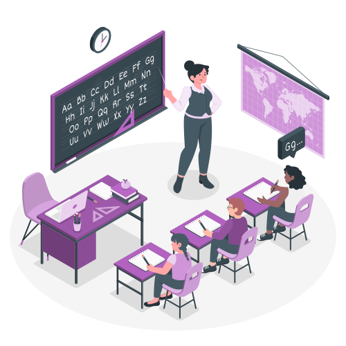
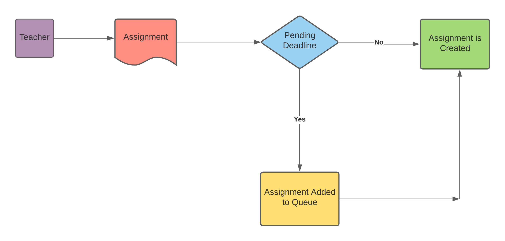
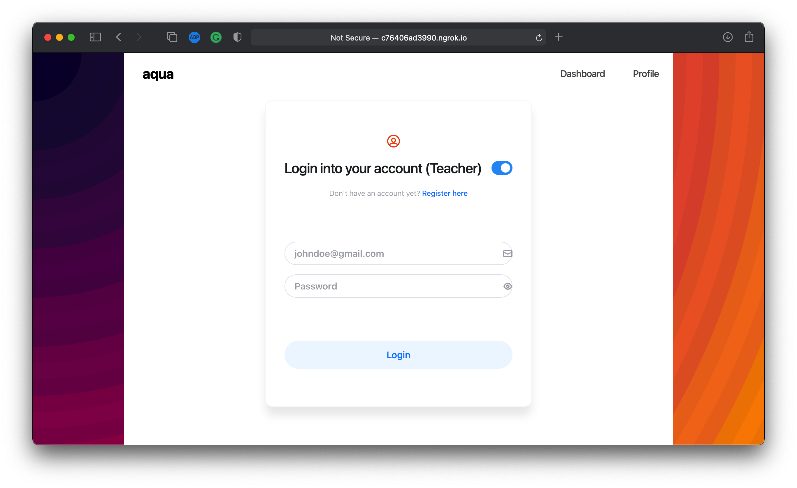
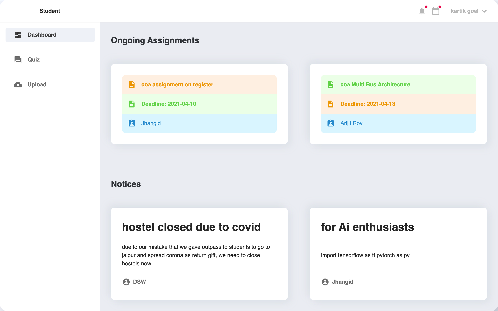
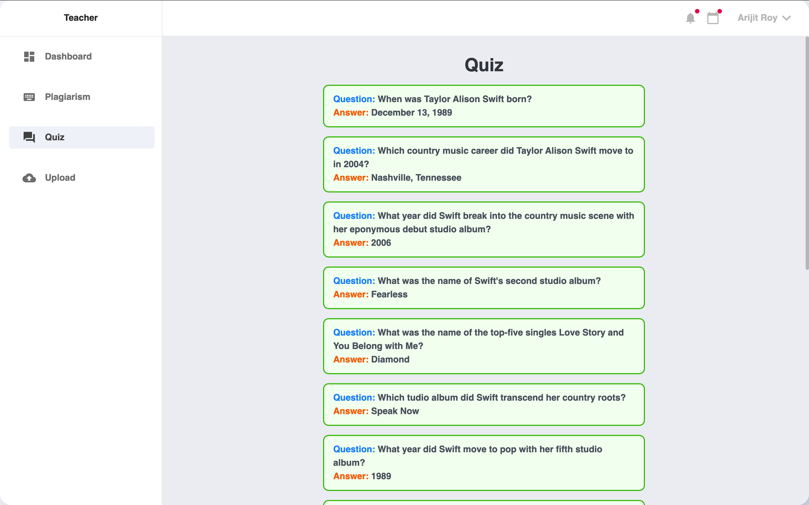
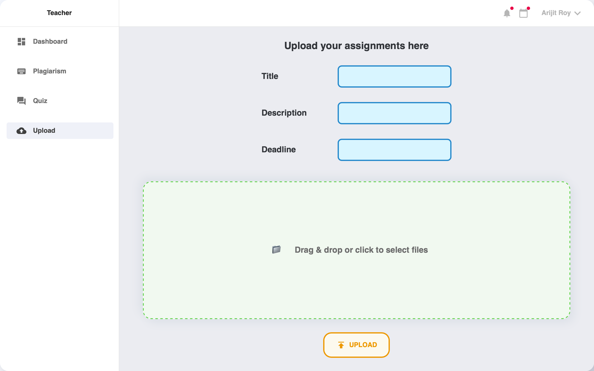
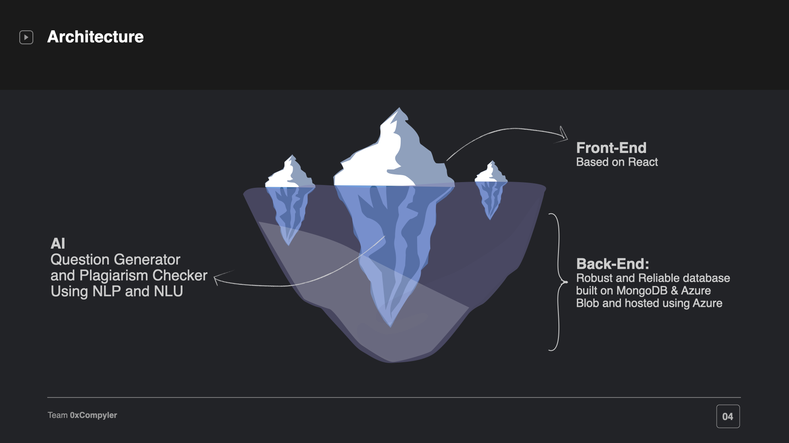

:construction: **This project is still under development** :construction:
<p float="left">

[](https://forthebadge.com) 
[](https://forthebadge.com)
[](https://forthebadge.com)
[](https://forthebadge.com)
</p>

<!-- PROJECT LOGO -->
<br/>
<p align="center">
  <a href="https://github.com/radioactive11/AQUA">
    

    
  </a>

  <h1 align="center">Project AQUA</h1>

  <p align="center">
    <strong>A</strong>ssignment <strong>Q</strong>uizzes <strong>U</strong>tility <strong>A</strong>pplication
    <br />
    <a href="https://aqua-client.vercel.app/h"><strong>Visit the website »</strong></a>
    <br />
    <br />
    <a href="https://aqua-client.vercel.app/">View Demo</a>
    ·
    <a href="https://github.com/radioactive11/AQUA/issues">Report Bug</a>
    ·
    <a href="https://github.com/radioactive11/AQUA/issues">Request Feature</a>
  </p>
</p>


<!-- TABLE OF CONTENTS -->
## Table of Contents

* [About the Project](#about-the-project)
  * [Question Generator](#Question-Generator)
  * [Plagiarism Checker](#plagiarism-checker)
  * [Built With](#built-with)
* [Getting Started](#getting-started)
  * [Prerequisites](#prerequisites)
  * [Installation](#installation)
* [Product Screenshots](#Product-Screenshots)
* [Roadmap](#roadmap)
* [Contributing](#contributing)
* [Contact](#contact)


<!-- ABOUT THE PROJECT -->
## About The Project

[![Product Name Screen Shot][product-screenshot]](http://aqua-app.now.sh/)

Project AQUA is a  platform that will **organize** the system of assignments and **quizzes** conducted by schools/colleges for the continuous evaluation of students.

<br/>

:woman_teacher: **We provide the following services**: 

:robot: AI powered Question Generator

:nerd_face: Plagiarism Checker

:bookmark: Notice Board

:cloud: Assignment Upload/Download Portal

:upside_down_face: Anti Burden System


For detailed descriiption of the services, plese visit the [usage](#usage) section

<br />


## Question Generator

We used *SQuADv1* dataset and and *T5 model* with *highlight* preprocessing format. This idea is proposed in the ["A Recurrent BERT-based Model for Question Generation"](https://www.aclweb.org/anthology/D19-5821.pdf)


<br />

## Plagiarism Checker

We used TF-IDF to vectorize the documents and then calculated the cosine similarity between them to check for potential plagiarism

<br />

## Built With

</br>
<p float = "left">


</p>


<!-- GETTING STARTED -->
## Getting Started

To get a local copy up and running follow these simple example steps.

### Prerequisites

* Node.js
* Python 3.7+


### Installation 

<br />

### Flask API
<br />

1. Clone the repo 
```sh
git clone https://github.com/radioactive11/AQUA
```


2. Create a Python 3 virtual environment (inside ai directory)
```sh
cd ai
python3 -m venv venv
source venv/bin/activate
```

3. Install requirements
```sh
pip install -r requirements.txt
```

4. Download Sentence Tokenizer
```sh
python -m nltk.downloader punkt
```

5. Make a ```secret.py``` file to hold API Keys
```python
AZURE_STORAGE_CONNECTION_STRING = <CONNECTION STRING>
API_KEY = <API KEY>
ENDPOINT = <ENDPOINT>
```

Refer to these pages on how to get [Azure Storage](https://docs.microsoft.com/en-us/azure/storage/common/storage-configure-connection-string#:~:text=You%20can%20find%20your%20storage,primary%20and%20secondary%20access%20keys.) and [Cognitive Services](https://docs.microsoft.com/en-us/azure/cognitive-services/what-are-cognitive-services#:~:text=and%20spell%20checking.-,Get%20started%20with%20Cognitive%20Services,Azure%20SDK%20client%20libraries) API Keys

</br>
5. Start Flask server

```sh
python app.py
```


<br />

### Node & React 

<br />

1. Clone the repo 
```sh
git clone https://github.com/radioactive11/AQUA
```

2. Install requirements (server)
```sh
cd server
npm install
```

3. Start Node server (by default at `localhost:5000`)
```sh
npm run dev
```

4. Install requirements (client)
```sh
cd ../client
npm install
```

5. Start React server (by default at `localhost:3000`)
```sh
npm start
```

<br />

<!-- USAGE EXAMPLES -->
## Flowchart




## Product Screenshots











<!-- ROADMAP -->
## Roadmap

See the [open issues](https://github.com/radioactive11/AQUA/issues) for a list of proposed features (and known issues).


<!-- CONTRIBUTING -->
## Contributing

Contributions are what make the open source community such an amazing place to be learn, inspire, and create. Any contributions you make are **greatly appreciated**.

1. Fork the Project
2. Create your Feature Branch (`git checkout -b feature/AmazingFeature`)
3. Commit your Changes (`git commit -m 'Add some AmazingFeature'`)
4. Push to the Branch (`git push origin feature/AmazingFeature`)
5. Open a Pull Request


<!-- CONTACT -->
## Contact

Arijit Roy - [GitHub](https://github.com/radioactive11) - roy.arijit2001@gmail.com

Kartik Goel - [GitHub](https://github.com/kg-kartik) - goel.kartik39@gmail.com

Boidushya - [GitHub](https://github.com/Boidushya) - amankumarjagdev@gmail.com

Aditya Yadav - [GitHub](https://github.com/aditya635) - adityayadav635@gmail.com

Website: [http://aqua-app.now.sh/](http://aqua-app.now.sh/)


<!-- MARKDOWN LINKS & IMAGES -->
<!-- https://www.markdownguide.org/basic-syntax/#reference-style-links -->
[contributors-shield]: https://img.shields.io/github/contributors/radiaoctive11/HealthBridge.svg?style=flat-square
[contributors-url]: https://github.com/radioactive11/AQUA/graphs/contributors
[forks-shield]: https://img.shields.io/github/forks/radiaoctive11/HealthBridge.svg?style=flat-square
[forks-url]: https://github.com/radioactive11/AQUA/network/members
[stars-shield]: https://img.shields.io/github/stars/radiaoctive11/HealthBridge.svg?style=flat-square
[stars-url]: https://github.com/radioactive11/AQUA/stargazers
[issues-shield]: https://img.shields.io/github/issues/radiaoctive11/HealthBridge.svg?style=flat-square
[issues-url]: https://github.com/radioactive11/AQUA/issues
[license-shield]: https://img.shields.io/github/license/radiaoctive11/HealthBridge.svg?style=flat-square
[license-url]: https://github.com/radioactive11/AQUA/blob/master/LICENSE.txt
[linkedin-shield]: https://img.shields.io/badge/-LinkedIn-black.svg?style=flat-square&logo=linkedin&colorB=555
[linkedin-url]: https://linkedin.com/in/othneildrew
[product-screenshot]: STATIC/Landing.png

[node-js]: "https://img.shields.io/badge/-JavaScript-F7DF1E?style=flat-square&logo=javascript&logoColor=black"
